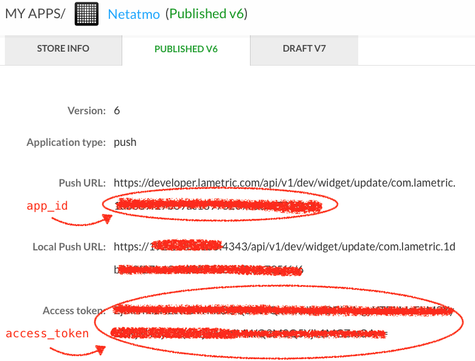
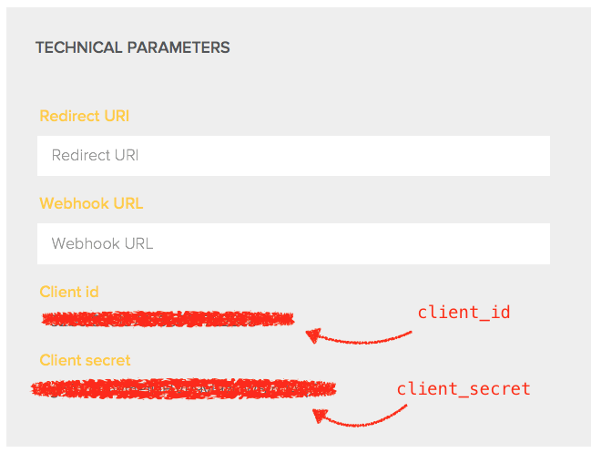

# LaMetric app for Netatmo Weather Station

A simple client which turns LaMetric into Netamo display. This client polls [Netatmo API](https://github.com/philippelt/netatmo-api-python)  and shows the weather data on LaMetric display.


## LaMetric Setup

Go to the [LaMetric Developper site](https://developer.lametric.com) signin with your credentials (or signup for an account if you haven't done so already). Now create your new app with with the following five frames:

1. "Name" frame for Outdoor temperature value
2. "Sparkline" frame for Outdoor temperature graph
3. "Name" frame for Outdoor humidity value
4. "Name" frame for Pressure trend (icon) and value
5. "Name" frame for Sunrise time
6. "Name" frame for Sunset time

*Note:* The text and icon on the each frame are optional. They will be overriden by the script anyway.



Now make a note of both `app_id` and `access_token` as per screenshot above and put them into your `config.ini` within the `[lametric]` part. Make sure to set the *Application type* to *push*. Publish your app as a private app.

## Netatmo Setup

Go to the [Netatmo Developer Site](https://dev.netatmo.com) again signin with your credentials (or signup for an account if you haven't done so already).

Create a Netatmo app. Leave both Redirect URI and Webhook URI empty. 



Now make a note of `client_id` and `client_secret`. The `username` which is your emaill and `password` are your Netatmo login credentials. Put all four settings into your `config.ini` within the `[netatmo]` part. Make sure to enable the app.

## The Script 

Once you have created both LaMetric and Netatmo apps you can use `updateLaMetric.py` to let them talk to each other. As described above the credentials are stored in `config.ini` file in the same directory as the script itself.

```
# Netatmo authentication
[netatmo]
client_id     = ...
client_secret = ...
username      = ...
password      = ...

# LaMetric authentication
[lametric]
access_token  = ...
app_id        = ...
```

Executing the `updateLaMetric.py` script should give you immediate feedback on how successful you are with the apps setup  process and credentials. Once everything is OK the easiest way to keep the LaMetric display updated is via cron task:

```
*/10 * * * * /home/lametric/updateLaMetric.py
```

Enjoy!
